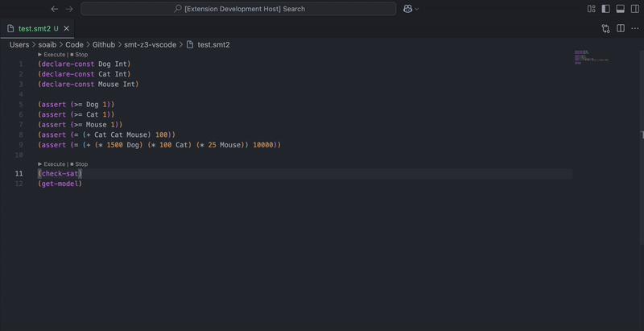

# Z3 Extension for Visual Studio Code

## Features

- Syntax highlighting for SMT-LIB2 files (`.smt2`, `.smt`) from [SMT.tmbundle](https://github.com/SRI-CSL/SMT.tmbundle)
- Execute SMT-LIB2 files with Z3 without explicitly installing Z3

> [!TIP]
> For language server support and use the Z3 solver online, check out the [FM Playground](https://play.formal-methods.net/?check=SMT)!

## Usage

For executing SMT-LIB2 files, open a `.smt2` or `.smt` file and click on the `▶ Execute` button in the top right corner of the editor. The result will be displayed in the output window. You can also open the command palette (Ctrl+Shift+P) and type `SMT-Z3: Execute Z3`.

For stopping the execution, click on the `⏹ Stop` button in the top right corner of the editor. 

### Configuration

Open the settings (Ctrl+Shift+P or ⌘ + ⇧ + P) and search for `SMT-Z3: Open Settings`. 

- Show Execute/Stop CodeLens button on the current line. 
    - This will show `Execute | Stop` on the current line of the editor.
- Show the timestamp of the last solve operation and the time taken.
    - This will show the timestamp of the last solve operation and the time taken in the output window.
- Timeout in milliseconds for SMT-Z3 execution.
    - This will set the timeout in milliseconds for the SMT-Z3 execution. The default value is 5000 ms.

## License

This extension is licensed under the MIT License.  See [LICENSE](LICENSE) for more information.